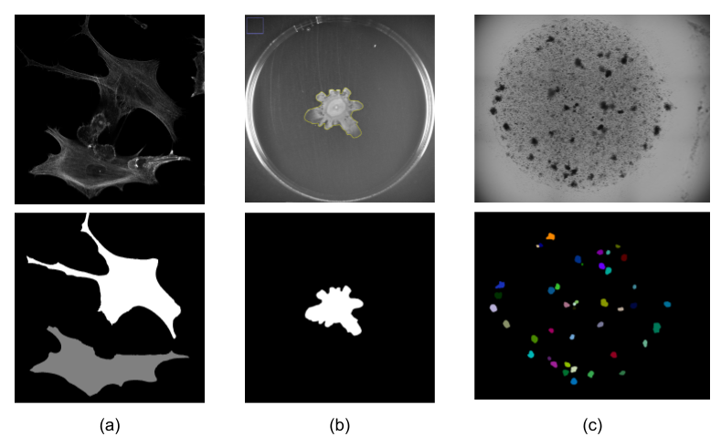

# SAMJ-IJ

The SAMJ-IJ is a powerful Fiji plugin for annotating microscopy images using various versions of the [Segment Anything](https://github.com/facebookresearch/segment-anything) Model (SAM). This README provides detailed instructions on how to use the plugin for image annotation. In this first version of the plugin, the SAMJ-IJ Annotator is delivered to annotate images through the usage of prompts. The plugin is designed to be user-friendly and efficient, allowing for easy and accurate image annotation for further analysis.

> [!NOTE]
> This is an **EARLY RELEASE**, many more improvements are coming! Your valuable suggestions for enhancements are encouraged in the [Issues section](https://github.com/segment-anything-models-java/SAMJ-IJ/issues) or on the [image.sc forum](https://forum.image.sc/).

## Contents
- [Installation](#installation)
- [Model Installation](#model-installation)
- [Annotating Images](#annotating-images)
- [Saving Annotations](#saving-annotations)
- [Usage Example](#usage-example)
- [Use Cases](#use-cases)
- [Contributors](#contributors)
- [Notes](#notes)

## Fiji and Plugin Installation

Before you can annotate images using SAMJ-IJ, you need to install the plugin in Fiji:

1. **Install Fiji**: If you haven't already, download and install [Fiji](https://fiji.sc/).

> [!IMPORTANT]
> For MacOS users, if your Fiji instance is launched from the Downloads folder, SAMJ will not work! Move Fiji to another folder, Documents or Desktop, for example.

2. **Install SAMJ Plugin**: Open Fiji and navigate to `Help > Update...`. In the `Manage update sites` window, and look for an update site named `SAMJ`, select it, click on `Apply and close` and then `Apply changes`. Finally restart Fiji.

   If you cannot find `SAMJ` among the update sites list, click on `Add update site`/`Add unlisted site`, write `SAMJ` in the `Name` field and `https://sites.imagej.net/SAMJ/` in the `URL` field. Click on `Apply and close`, click on `Apply changes` and restart Fiji. 

5. **Open SAMJ-IJ Annotator**: Start Fiji and navigate to `Plugins > SAMJ > SAMJ Annotator` to open the plugin.

## Model Installation

To use the SAMJ-IJ plugin, you must install a SAM model. These are the models available for installation:
* **EfficientSAM:** A [base model](https://github.com/yformer/EfficientSAM/tree/main) designed for segmentation tasks, optimized for performance on standard computational resources. Ideal for accurate annotations and segmentations Computationally heavy. Do not use on low-end computers.
* **EfficientViTSAM-l0:** A lightweight variant of the [EfficientViTSAM](https://arxiv.org/abs/2402.05008) model, offering a balance between segmentation accuracy and computational demand, suitable for use on regular computers.
* **EfficientViTSAM-l1:** An intermediate version, providing enhanced accuracy for complex segmentation tasks with manageable resource requirements.
* **EfficientViTSAM-l2:** A more advanced version, designed for high-accuracy segmentation in demanding scenarios, requiring higher computational resources.
* **EfficientViTSAM-xl0:** An extra-large model variant, pushing the boundaries of segmentation accuracy at the expense of increased computational demand.
* **EfficientViTSAM-xl1:** The most advanced and resource-intensive version, offering state-of-the-art segmentation performance for the most challenging tasks.

> [!WARNING]
> Users with a low-end computer are advised not to use the **EfficientSAM** model as it might take up to 10 minutes to load the first time, or the computer can even be frozen. The fastest and lightest model is **EfficientViTSAM-l0**, but low-resource machines might take up to 2-3 minutes to load the first time. Subsequent loading times will be much faster (~10s).

These are the steps to install a model:
1. Open the SAMJ Annotator plugin as described above.
2. Choose a SAM model from the list provided within the plugin.
3. Click on the `Install` button next to the selected model.
4. Wait for the installation process to complete. This may take some time, depending on the model size, your computer and your internet connection.

> [!CAUTION]
> Model installation times vary based on your machine's specifications, ranging from seconds to up to 20 minutes. Please be patient.

This video demonstrates the live installation of EfficientViTSAM-l1 on a Mac M1.

## Annotating Images

Once you have installed a model, follow these steps to annotate your image:

1. **Open Image**: Open the microscopy image you want to annotate in Fiji.
2. **Select the Image**: In the SAMJ Annotator plugin, ensure your image is selected in the dropdown bar.
3. **Start Annotation**: Click on `Go!` to begin the annotation process. This button will encode your image so you can start annotating. It can take a while.
4. **Choose Annotation Method**: Use one of the following tools to annotate your image:
   - `Rectangle (Rect)`: Draw rectangular Regions Of Interest (ROIs).
   - `Points`: Click to mark points on the image. Hold `Ctrl` to select multiple points for a single object.
   - `Brush`: Paint freeform ROIs.

   Optionally, untick the `Add to ROI Manager` checkbox if you don't want your annotations to be added to the Fiji ROI Manager automatically.
   *Note: the first annotation can take several seconds.*
5. **Annotate**: Annotate as many objects as needed. With each ROI drawn using one of the three tools, the installed SAM version will run, and the object will be annotated.
6. **Manage Annotations**: All annotations will be sent to the ROI Manager (if the checkbox is ticked), where you can perform various operations as allowed by Fiji's ROI Manager functionality.

## Saving Annotations

### All ROIs or the largest one
To save your annotations, you can opt for either exporting every ROI using the "Return all ROIs" feature or selecting "Only return the largest ROI" to export solely the largest one. In the context of annotating heterogeneous images with various ROIs, as displayed below, you have the choice to either preserve the entirety of the ROIs, which would include every annotated object, such as the nuclei and the entire embryo or to conserve exclusively the predominant ROI, which, in this example, would be the complete embryo.

### Export to Labelling

This button simplifies the process of exporting your annotations, which are saved as semantic annotations where each marked region is assigned a distinct value. For enhanced visual clarity, we suggest altering the Look-Up Table (LUT) in Fiji (Image > Lookup Tables > Glasbey or choose another option).

  
   

## Usage Example

Below is an illustration of object annotation using the SAMJ-IJ plugin. Each object is delineated and labelled to showcase the plugin's straightforward and efficient capabilities in image analysis.

Follow this comprehensive workflow to annotate your image with SAMJ-IJ:

1. **Model Installation**: Choose and install your preferred model for image annotation. Refer to [Model Installation](#model-installation) for detailed information on each model.
2. **Open Image in Fiji**: Navigate to `File > Open` in Fiji or drag and drop your image directly into the interface.
3. **Encode Image**: With the model installed and the image open, select your image from the dropdown menu and click `Go!` to encode it. This may take some time depending on your system's capabilities.
4. **Annotation**: Annotate your image freely. All annotations will appear in the ROI manager. For clarity, when dealing with numerous closely spaced ROIs, uncheck the `Labels` option in the ROI manager. See [Annotating Images](#annotating-images) for more details.
5. **Export Annotations**: Once finished with the annotations, click `Export to Labelling...` to save your semantic annotations.
6. **Enhance Visualization**: Improve the visibility of your mask by altering the LUT. For example, you can apply the Glasbey LUT via `Image > Lookup Tables > Glasbey`.

## Use Cases
This Fiji plugin is intended for working with microscopy images. To show its versatility among different images, here are some use cases. 

#### a) Astrocytes stained for actin
The original image (top left in the figure) displays astrocytes stained for actin following mechanical deformation, as part of a study exploring the mechanical and functional responses of astrocytes using magneto-active substrates [1]. The annotated image (bottom left in the figure) highlights individual astrocytes for detailed analysis. 
This annotation was accomplished using the "Points Prompt" feature coupled with the "Return Only Largest ROI" option to selectively annotate each astrocyte visible in the image. The primary goal of this annotation is to facilitate a comparative study of astrocyte morphology pre- and post-deformation, thus contributing valuable insights into the biomechanical properties and adaptive responses of astrocytes under stress.

#### b) Bacterial mobility on agar plates
The images (top center and bottom center in the figure) showcase the results of mobility assays for *Pseudomonas aeruginosa* strains on agar plates [2]. These assays are crucial for studying the surface motility of bacteria, which is considered a key factor in pathogenicity due to its role in chemotaxis, biofilm formation, and overall virulence. The original images depict the spread of bacteria on agar plates following incubation, captured using the Chemi DOC™ image system. The annotations made using the SAMJ plugin allow for precise measurement and analysis of the spread area, significantly automating a task that was previously manual, tedious, and time-consuming. By leveraging SAMJ for these annotations, researchers can efficiently quantify bacterial motility, facilitating deeper insights into bacterial behavior and its implications on disease spreading and antimicrobial resistance. This enhances the plugin's value in microbial research, providing a robust tool for assessing bacterial dynamics in a consistent and reproducible manner.

#### c) Organoids
The images (top right and bottom right in the figure) illustrate organoids captured for the purpose of segmentation, counting, and analysis of morphological features such as area and eccentricity [3]. These organoids are typically used to model biological processes in vitro, providing a robust platform for studies in developmental biology, disease pathology, and drug screening. The original images capture the diverse shapes and sizes of organoids, which can be challenging to quantify manually. Using the SAMJ plugin, researchers can automate the segmentation and counting of organoids, and accurately measure their area and eccentricity. This annotation capability not only enhances the precision and efficiency of the analysis but also supports high-throughput screening and detailed morphometric assessments. The ability of SAMJ to handle such complex image data demonstrates its utility in advanced biological research and experimental reproducibility.

#### References
[1] Gomez‐Cruz, C., Fernandez‐de la Torre, M., Lachowski, D., Prados‐de‐Haro, M., del Río Hernández, A. E., Perea, G., ... & Garcia‐Gonzalez, D. (2024). Mechanical and Functional Responses in Astrocytes under Alternating Deformation Modes Using Magneto‐Active Substrates. Advanced Materials, 2312497.
[2] Casado-Garcia, A., Chichón, G., Dominguez, C., Garcia-Dominguez, M., Heras, J., Ines, A., ... & Saenz, Y. (2021). MotilityJ: An open-source tool for the classification and segmentation of bacteria on motility images. Computers in biology and medicine, 136, 104673.
[3] Segmentation, counting, measurement of area and eccentricity (circularity) of organoids in [image.sc forum](https://forum.image.sc/t/segmentation-counting-measurement-of-area-and-eccentricity-circularity-of-organoids/90751)

## Contributors

**Carlos García-López-de-Haro**, *Bioimage Analysis Unit, Institut Pasteur, Université Paris Cité, Paris, France* - [@carlosuc3m](https://github.com/carlosuc3m)  
**Caterina Fuster-Barceló**, *Bioengineering Department, Universidad Carlos III de Madrid, Leganés, Spain* - [@cfusterbarcelo](https://github.com/cfusterbarcelo)  
**Curtis T. Rueden**, *Center for Quantitative Cell Imaging, University of Wisconsin, Madison, USA* - [@ctrueden](https://github.com/ctrueden)  
**Jónathan Heras**, *Department of Mathematics and Computer Science, University of La Rioja, Logroño, Spain* - [@joheras](https://github.com/joheras)  
**Vladimir Ulman**, *IT4Innovations, VSB - Technical University of Ostrava, Ostrava, Czech Republic* - [@xulman](https://github.com/xulman)  
**Adrián Inés**, *Department of Mathematics and Computer Science, University of La Rioja, Logroño, Spain* - [@adines](https://github.com/adines)  
**Kevin Eliceri**, *Center for Quantitative Cell Imaging, University of Wisconsin, Madison, USA*  - [@eliceiri](https://github.com/eliceiri)  
**J.C. Olivo-Marin**, *CNRS UMR 3691, Institut Pasteur, Paris, France*  
**Daniel Sage**, *Biomedical Imaging Group and Center for Imaging, École Polytechnique Fédérale de Lausanne (EPFL), Lausanne, Switzerland* - [@dasv74](https://github.com/dasv74)  
**Arrate Muñoz-Barrutia**, *Bioengineering Department, Universidad Carlos III de Madrid, Leganés, Spain* - [@arratemunoz](https://github.com/arratemunoz)

## Notes

- This plugin is intended to use with microscopy images.
- The documentation here is for users only. Developer documentation, including contribution guidelines, will be available in a separate repository.
- For further assistance or to report issues, please visit the [plugin's repository](https://github.com/segment-anything-models-java/SAMJ-IJ).

Thank you for using the SAMJ-IJ Fiji plugin!
