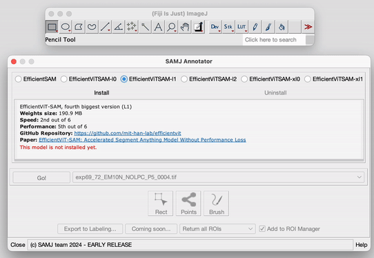
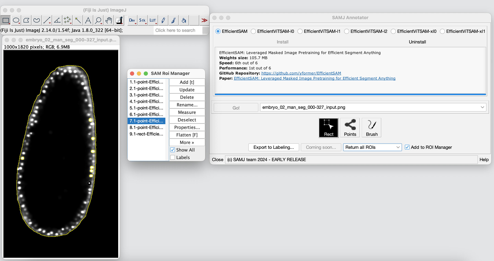

# SAMJ-IJ

The SAMJ-IJ is a powerful Fiji plugin for annotating microscopy images using various versions of the Segment Anything Model (SAM). This README provides detailed instructions on how to use the plugin for image annotation. In this first version of the plugin, the SAMJ-IJ Annotator is delivered to annotate images through the usage of prompts. The plugin is designed to be user-friendly and efficient, allowing for easy and accurate image annotation for further analysis.

> [!NOTE]
> This is an **EARLY RELEASE**, many more improvements are coming! Your valuable suggestions for enhancements are encouraged in the [Issues section](https://github.com/segment-anything-models-java/SAMJ-IJ/issues) or on the [image.sc forum](https://forum.image.sc/).

## Contents
- [Installation](#installation)
- [Model Installation](#model-installation)
- [Annotating Images](#annotating-images)
- [Saving Annotations](#saving-annotations)
- [Usage Example](#usage-example)
- [Notes](#notes)

## Fiji and Plugin Installation

Before you can annotate images using SAMJ-IJ, you need to install the plugin in Fiji:

1. **Install Fiji**: If you haven't already, download and install [Fiji](https://fiji.sc/).

> [!IMPORTANT]
> For MacOS users, if your Fiji instance is launched from the Downloads folder, SAMJ will not work! Move Fiji to another folder, Documents or Desktop, for example.
2. **Install SAMJ Plugin**: Open Fiji and navigate to `Help > Update...`. In the `Manage update sites` window, and look for an update site named `SAMJ`, select it, click on `Apply and close` and then `Apply changes`. Finally restart Fiji.

   If you cannot find `SAMJ` among the update sites list, click on `Add update site`/`Add unlisted site`, write `SAMJ` in the `Name` field and `https://sites.imagej.net/SAMJ/` in the `URL` field. Click on `Apply and close`, click on `Apply changes` and restart Fiji. 

5. **Open SAMJ-IJ Annotator**: Start Fiji and navigate to `Plugins > SAMJ > SAMJ Annotator` to open the plugin.

## Model Installation

To use the SAMJ-IJ plugin, you must install a SAM model. These are the models available for installation:
* **EfficientSAM:** This is a base model designed for segmentation tasks, optimized for efficiency and performance on standard computational resources. It is ideal for quick, accurate segmentation in real-time applications.
* **EfficientViTSAM-l0:** This is a lightweight variant of the EfficientViTSAM model. It offers a balance between segmentation accuracy and computational demand and is suitable for use on regular computers.
* **EfficientViTSAM-l1:** This is an intermediate version that provides enhanced accuracy for complex segmentation tasks with manageable resource requirements.
* **EfficientViTSAM-l2:** This is a more advanced version designed for high-accuracy segmentation in demanding scenarios that require higher computational resources.
* **EfficientViTSAM-xl0:** This is an extra-large model variant that pushes the boundaries of segmentation accuracy at the expense of increased computational demand.
* **EfficientViTSAM-xl1:** The most advanced and resource-intensive version, offering state-of-the-art segmentation performance for the most challenging tasks.

> [!WARNING]
> Users with a low-end computer are advised not to use the **EfficientSAM** model as it might take up to 10 minutes to load the first time, or the computer can even be frozen. The fastest and lightest model is **EfficientViTSAM-l0**, but low-resource machines might take up to 2-3 minutes to load the first time. Subsequent loading times will be much faster (~10s).

These are the steps to install a model:
1. Open the SAMJ Annotator plugin as described above.
2. Choose a SAM model from the list provided within the plugin.
3. Click on the `Install` button next to the selected model.
4. Wait for the installation process to complete. This may take some time depending on the model size, your computer and your internet connection.

> [!CAUTION]
> Model installation times vary based on your machine's specifications, ranging from seconds to up to 20 minutes. Please be patient.

This video demonstrates the live installation of EfficientViTSAM-l1 on a Mac M1.

## Annotating Images

Once you have installed a model, follow these steps to annotate your image:

1. **Open Image**: Open the microscopy image you want to annotate in Fiji.
2. **Select the Image**: In the SAMJ Annotator plugin, ensure your image is selected in the dropdown bar.
3. **Start Annotation**: Click on `Go!` to begin the annotation process. This button will encode your image so you can start annotating. It can take a while.
4. **Choose Annotation Method**: Use one of the following tools to annotate your image:
   - `Rectangle (Rect)`: Draw rectangular Regions Of Interest (ROIs).
   - `Points`: Click to mark points on the image. Hold `Ctrl` to select multiple points for a single object.
   - `Brush`: Paint freeform ROIs.

   Optionally, untick the `Add to ROI Manager` checkbox if you don't want your annotations to be added to the Fiji ROI Manager automatically.
   *Note: the first annotation can take several seconds.*
5. **Annotate**: Annotate as many objects as needed. With each ROI drawn using one of the three tools, the installed SAM version will run and the object will be annotated.
6. **Manage Annotations**: All annotations will be sent to the ROI Manager (if the checkbox is ticked), where you can perform various operations as allowed by Fiji's ROI Manager functionality.

## Saving Annotations

### All ROIs or the largest one
To save your annotations, you can opt for either exporting every ROI using the "Return all ROIs" feature or selecting "Only return the largest ROI" to export solely the largest one. In the context of annotating heterogeneous images with various ROIs, as displayed below, you have the choice to either preserve the entirety of the ROIs, which would include every annotated point such as the nuclei and the entire embryo, or to conserve exclusively the predominant ROI, which, in this instance, would be the complete embryo.

### Export to Labelling

This button simplifies the process of exporting your annotations, which are saved as semantic annotations where each marked region is assigned a distinct value. For enhanced visual clarity, we suggest altering the Look Up Table (LUT) in Fiji (Image > Lookup Tables > Glasbey or choose another option).

  
   

## Usage Example

Below is an illustration of object annotation using the SAMJ-IJ plugin. Each object is delineated and labeled to showcase the plugin's straightforward and efficient capabilities in image analysis.

Follow this comprehensive workflow to annotate your image with SAMJ-IJ:

1. **Model Installation**: Choose and install your preferred model for image annotation. Refer to [Model Installation](#model-installation) for detailed information on each model.
2. **Open Image in Fiji**: Navigate to `File > Open` in Fiji or drag and drop your image directly into the interface.
3. **Encode Image**: With the model installed and the image open, select your image from the dropdown menu and click `Go!` to encode it. This may take some time depending on your system's capabilities.
4. **Annotation**: Annotate your image freely. All annotations will appear in the ROI manager. For clarity when dealing with numerous closely spaced ROIs, uncheck the `Labels` option in the ROI manager. See [Annotating Images](#annotating-images) for more details.
5. **Export Annotations**: Once finished with the annotations, click `Export to Labelling...` to save your semantic annotations.
6. **Enhance Visualization**: Improve the visibility of your mask by altering the LUT. For example, you can apply the Glasbey LUT via `Image > Lookup Tables > Glasbey`.

## Contributors

**Carlos García-López-de-Haro**, *Bioimage Analysis Unit, Institut Pasteur, Université Paris Cité, Paris, France* - [@carlosuc3m](https://github.com/carlosuc3m)  
**Caterina Fuster-Barceló**, *Bioengineering Department, Universidad Carlos III de Madrid, Leganés, Spain* - [@cfusterbarcelo](https://github.com/cfusterbarcelo)  
**Curtis T. Rueden**, *Center for Quantitative Cell Imaging, University of Wisconsin, Madison, USA* - [@ctrueden](https://github.com/ctrueden)  
**Jónathan Heras**, *Department of Mathematics and Computer Science, University of La Rioja, Logroño, Spain* - [@joheras](https://github.com/joheras)  
**Vladimir Ulman**, *IT4Innovations, VSB - Technical University of Ostrava, Ostrava, Czech Republic* - [@xulman](https://github.com/xulman)  
**Adrián Inés**, *Department of Mathematics and Computer Science, University of La Rioja, Logroño, Spain* - [@adines](https://github.com/adines)  
**Kevin Eliceri**, *Center for Quantitative Cell Imaging, University of Wisconsin, Madison, USA*  
**J.C. Olivo-Marin**, *CNRS UMR 3691, Institut Pasteur, Paris, France*  
**Daniel Sage**, *Biomedical Imaging Group and Center for Imaging, École Polytechnique Fédérale de Lausanne (EPFL), Lausanne, Switzerland* - [@dasv74](https://github.com/dasv74)  
**Arrate Muñoz-Barrutia**, *Bioengineering Department, Universidad Carlos III de Madrid, Leganés, Spain* - [@arratemunoz](https://github.com/arratemunoz)

## Notes

- This plugin is intended for use with microscopy images.
- The documentation here is for users only. Developer documentation, including contribution guidelines, will be available in a separate repository.

For further assistance or to report issues, please visit the [plugin's repository](https://github.com/segment-anything-models-java/SAMJ-IJ).

Thank you for using the SAMJ-IJ Fiji plugin!
